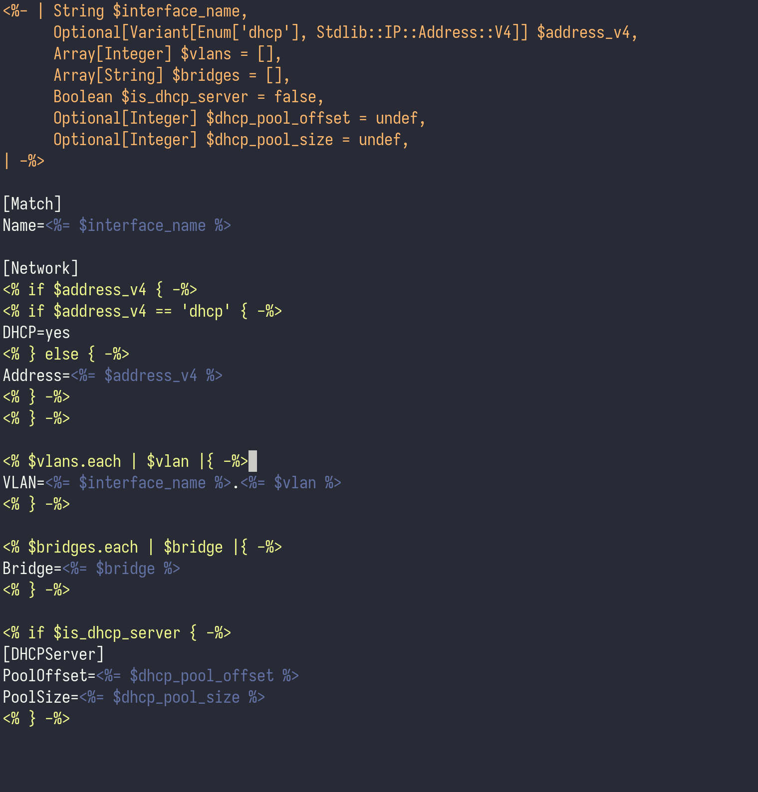

# epp-mode

A minor emacs mode for editing OpenVox/Puppet epp files

## Features

- basic Syntax highlighting
- electric pair mode

## Contribution

Feel free to make this mode better and create Issues or provide PRs

